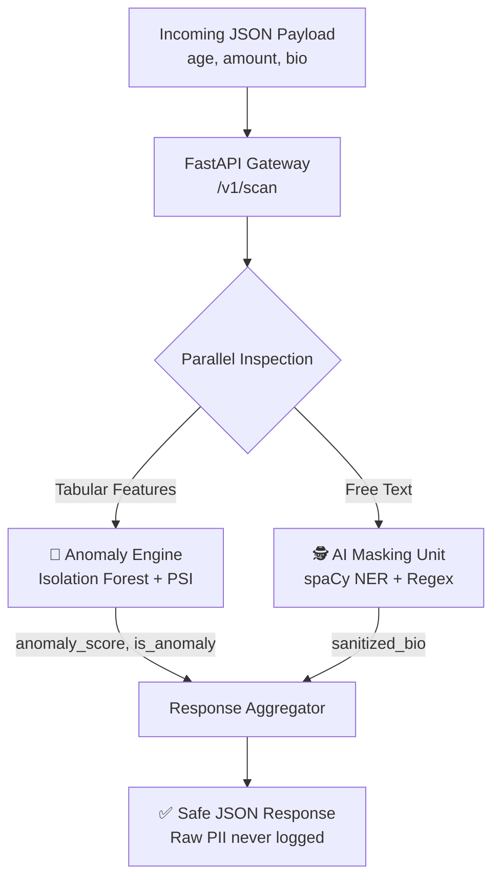

Markdown# 🛡️ GuardAI: Enterprise AI Guardrail & Anomaly Detection Pipeline

**Catches bad data before it breaks your models. Redacts PII before it leaks into your logs.**

Overview • Features • Architecture • Quick Start • API • Tests • Skills

---

**📌Overview**

Enterprises ingest constant streams of user-generated data — transactions, support tickets, form submissions. Two things silently go wrong with that data if nobody's watching:
1. **📉 Statistical drift:** Incoming data quietly shifts away from what a downstream ML model was trained on, degrading predictions until someone notices too late.
2. **🔓 PII leakage:** Free-text fields (bios, comments, notes) routinely contain names, emails, and phone numbers that should never reach raw logs, analytics warehouses, or third-party tools.

**GuardAI** is a guardrail service that sits at the point of ingestion and solves both problems in a single API call: every record is scored for anomaly risk and sanitized for PII before it moves downstream.

---

**✨Key Features**

* **🎯 Unsupervised anomaly detection:** `Isolation Forest` — no labeled fraud/anomaly data required.
* **📊 Statistical drift monitoring:** Population Stability Index (PSI) — the same metric real MLOps teams use to trigger retraining.
* **🕵️ Context-aware PII masking:** `spaCy` NER understands "Alice Smith is a person" from sentence context, not just a hardcoded list.
* **🛟 Regex safety net:** Catches emails & phone numbers NER models often miss.
* **✅ Schema validation:** `Pydantic` rejects malformed requests before they touch any model.
* **🐳 Fully containerized:** Docker image trains the model at build time — ready to serve immediately.
* **🧪 Unit-tested:** 9 passing `pytest` tests, with mocked external dependencies.

---

 **🏗️Architecture**



**🧰 Tech Stack**

```
Layer	          Technology
Language	      Python 3.10
Classical ML	  scikit-learn (Isolation Forest), NumPy, Pandas
NLP / AI	      spaCy (Named Entity Recognition)
Backend API	      FastAPI, Pydantic, Uvicorn
Testing	          pytest (with mocking)
Deployment	      Docker
```

**🚀Quick Start**

```
1. Clone the repository
```
Bashgit clone [https://github.com/Sachin2400/guardai-anomaly-detection-pipeline.git](https://github.com/Sachin2400/guardai-anomaly-detection-pipeline.git)
cd guardai-anomaly-detection-pipeline
```

2. Create environment & install dependencies
```
Bashconda create -n guardai python=3.10 -y
conda activate guardai
pip install -r requirements.txt
python -m spacy download en_core_web_sm
```

3. Generate data + train the anomaly model
```
Bashpython src/data_generation.py
python src/anomaly_engine.py
```

4. Run tests
```
Bashpytest -v
```

5. Launch the APIBashuvicorn src.api:app --reload --port 8000
```
Open http://127.0.0.1:8000/docs for interactive Swagger UI.🐳 Or run it with Docker:Bashdocker build -t guardai:latest .
docker run -p 8000:8000 guardai:latest

**📡API Usage**
```

POST /v1/scanRequest:JSON{
  "user_data": {
    "age": 45,
    "amount": 95000,
    "bio": "My name is Alice Smith and my email is alice@example.com."
  }
}
Response:JSON{
  "is_anomaly": true,
  "anomaly_score": -0.1945,
  "sanitized_bio": "My name is [PERSON] and my email is [EMAIL].",
  "entities_masked": 2
}
GET /v1/healthJSON{
  "status": "ok", 
  "model_loaded": true
}

```

**🧪Testing**

```
Run pytest -v to execute the test suite.Test AreaCoverageAnomaly EngineNormal vs. extreme record classificationPSI Drift MetricIdentical & shifted distribution scenariosPII MaskingEntity + regex merge logic (mocked NER)API/v1/health, /v1/scan happy path & validation errorsResult: 9/9 tests passing ✅
```

**📁 Project Structure**
```
PlaintextGuardAI/
├── src/
│   ├── data_generation.py   # Synthetic baseline + drift datasets
│   ├── anomaly_engine.py    # Isolation Forest + PSI
│   ├── ner_masking.py       # spaCy NER + PII masking
│   └── api.py               # FastAPI app
├── tests/
│   └── test_pipeline.py     # 9 passing pytest tests
├── data/                    # generated CSVs + trained model (gitignored)
├── requirements.txt
├── Dockerfile
└── README.md
```

**💡Skills** 

```
      Area                                               Evidence
Machine Learning	                       Trained & tuned Isolation Forest; implemented PSI from first principles
Applied NLP	                               Entity-recognition pipeline with span-merging for overlapping matches
Backend Engineering	                       Validated REST API with clean request/response contracts
MLOps	                                   Drift monitoring — the metric that triggers real retraining pipelines
Testing	                                   Pytest suite mocking external dependencies
DevOps	                                   Dockerfile that trains the model at build time — a deployment-ready image
Privacy Engineering	                       Raw PII never logged, by architecture — not just by policy

```

**🛣️Roadmap[ ]**

```
Swap batch Isolation Forest for a streaming/online anomaly detector.[ ] Add Prometheus metrics for live anomaly-rate dashboards.[ ] Swap spaCy for a transformer-based NER model for higher recall on messy text.[ ] Add a compliance-friendly audit log (entity type + count only, never raw PII).
```

**📄LicenseMIT** — free to use, modify, and learn from.
